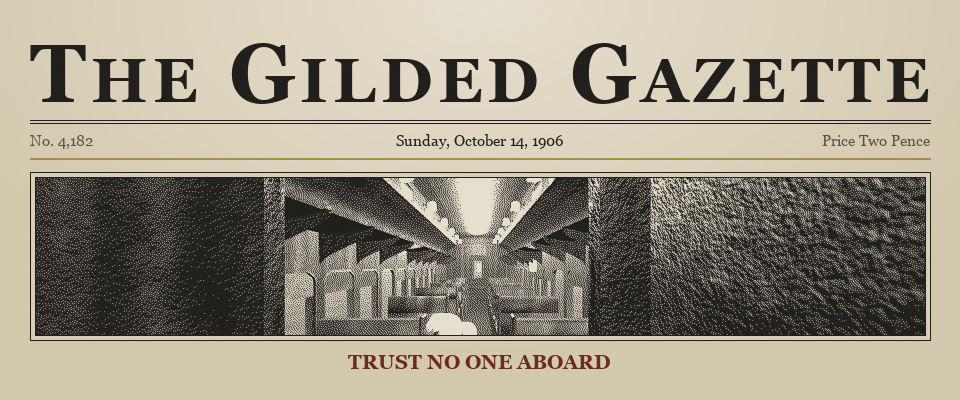
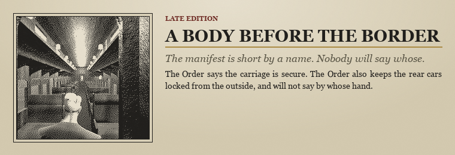
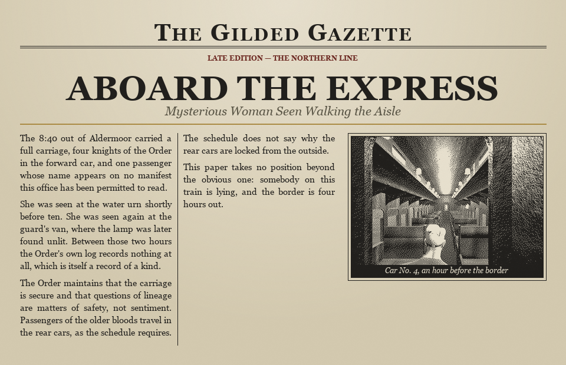
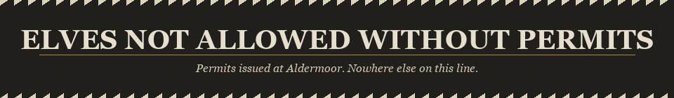
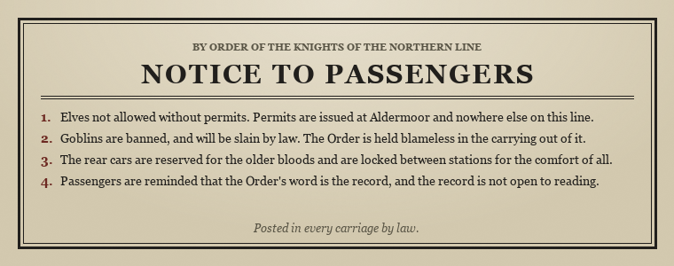
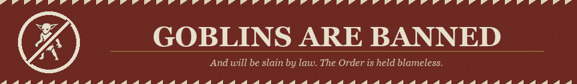

# TRUST NO ONE ABOARD

*A murder, a border, and no honest word between them.*

The 8:40 train out of Aldermoor runs north through the forest and reaches the border at dawn. With a full carriage and four knights of the Order in the forward car. Before the train crosses the border, at least one soul aboard will cross another.

You walk the aisle. You read the paper. You decide who is lying.

## The Carriage

The Order runs this line, and the Order keeps an order. Human knights forward, in the
lit cars, with the tea service. The older bloods to the rear, behind a door that locks
from the outside, because the schedule requires it and nobody signs the schedule.

Everyone aboard has a reason to be believed. Most of them are lying about which one.

## What You Do

- **Walk the train.** Every carriage, every compartment, every passenger in it.
- **Read the Gazette.** The evening edition prints what the train knows. It prints what
  the Order wants printed, too, and the two are not the same paper.
- **Question the manifest.** Names, seats, tickets. The gaps are the evidence.
- **Reach the border.** Four hours. Whatever you have settled by then is the verdict.

## Controls

| Input | Action |
| --- | --- |
| **WASD** | Walk |
| **Mouse** | Look |
| **E** / **F** | Interact — sit, question, take |
| **G** | Second interaction |
| **Space** | Jump |
| **Backspace** | Take control |
| **Esc** | Pause |

Runs in the browser. No download.

## Credits

Made for **Brackeys Jam 16** — *Trust No One* — by Rhombert, Moshhhhh and h0lybyte.

Built in Godot 4. Full asset attribution on the GitHub repository.
